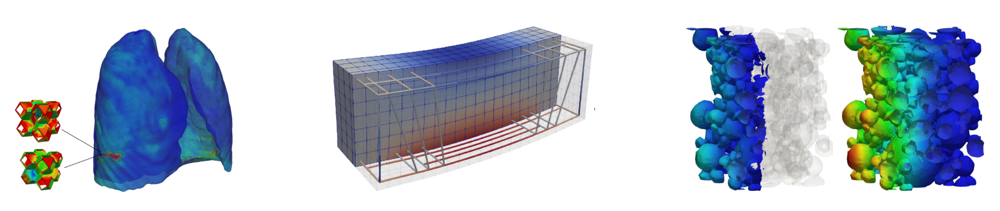

- TOC
{:toc}

# 4C: A multiphysics solver

4C is a code for highly parallelized multiphysics computer simulations at the continuum scale. It is based on BACI, a code project that has been developed at the Institute for Computational Mechanics of the Technical University of Munich over more than a decade. We believe that research in our community will benefit significantly from such a tool, making our daily work more efficient. The development goes hand in hand with the progress being made within deal.II, which is also part of the HiRSE_PS project. There is a worldwide community driving deal.II, a C++ software library on which the 4C code relies heavily. It provides the finite element backend, linear algebra functionality as well as all parallelization ingredients (MPI, threading via TBB, SIMD, GPU support) to successfully run simulations on both laptops and supercomputers (e.g. 300,000 processes on SuperMUC-NG). deal.II is freely available under LGPL 2.1 license.

## Goals

* Establish 4C as a simulation environment for multiphysics problems
  - 4C aims at full spectrum from pure research questions to real-world applications
  - 4C aims at realistic applications
  - 4C aims at realizing computationally efficient solvers (from a methodological and algorithmic perspective, and from an HPC perspective)
* Use modern C++ standard and software design patterns
* Jointly develop deal.II and 4C: New modules of 4C are in parts directly included in and published via deal.II, aiming generally at enhanced multiphysics capabilities of deal.II. Every development focuses on (high) performance aspects and appropriate testing infrastructure to identify deficiencies as early as possible
* 4C as a lean project utilizing state-of-the-art libraries (deal.II, Trilinos, ExaDG)

## Activities

* Modernize code base to cope with latest hardware requirements to run efficiently on new HPC systems
* Increase user friendliness by improved and unified documentation with a strong focus on new users and developers
* Introduction of Continuous Benchmarking
* Community building event to foster team spirit (Raitenhaslach, 1-3 February 2023)

* Next community building event in Herrsching am Ammersee, 25-27 September 2024

