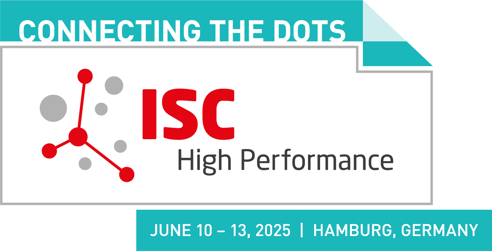

Tools and Techniques for Continuous Integration and Benchmarking, 13th June 2025, ISC, Hamburg

It has long been understood that there is a strong overlap between the fields of HPC and RSE. Although the two are not entirely congruent, the techniques used and the communities are closely interlinked.
For the second time an RSEHPC workshop will be held at ISC.
In this workshop, the focus will be placed on discussing the impact, usages, and implementations of continuous integration and benchmarking for heterogeneous, extreme-scale HPC systems.

Submission for lightning talk contributions is open.

<!--more-->

It has long been understood that there is a strong overlap between the fields of HPC and RSE. Although the two are not entirely congruent, the techniques used and the communities are closely interlinked.
For the second time an RSEHPC workshop will be held at ISC.

When developing research software, it is often relevant to track its performance over time. It is even vital when targeting HPC architectures. Changes to the software itself, the used toolchains, or the system setup should not compromise how fast users obtain their results. Ideally, performance or scalability should only ever increase. Hence benchmarking should be an integral part of testing, in particular for HPC codes. At the same time, up-to-date benchmarks that are publicly available can advertise the code and the machines running them, informing users how to set-up the software in the most ideal way or whether they are achieving the expected performance. To limit the burden on developers, the aforementioned steps should be automated within continuous integration (CI) practices, introducing continuous benchmarking (CB) to it. For HPC, an added complexity is the requirement of more than the usual CI backends, with access to longer running steps, more resources than available on a single node, and a diverse range of architectures that the software needs to be tested on.

In this workshop, participants will be able to exchange ideas, approaches, good practices, but also obstacles on the way to continuous benchmarking on HPC systems. Driven by three keynote talks which will set the stage, participants are encouraged to share their own experiences, both from a users and from an operations perspective. To foster this exchange, we foresee the second part of the workshop to provide a stage for participants to contribute their expertise, and experience with lightning talks. For the lightning talks a light-weight submission will be set up and reviewed by well known international RSE and HPC experts.
In addition, we foresee a part where open questions to the audience will be posed, helping everyone to add their thoughts to this event.

Topics include, but are not limited to:
- User’s perspective: How do users experience the existing solutions? Is there
something missing, from technological solutions to convenience?
- Operations’ perspective: What does it take for hosting sites to start and to maintain
an CI/CB infrastructure? What are benefits, what are burdens?
- Success stories and scary tales: where did CI/CB help to identify problems? Where
could it have helped? And what did hinder the adaptation of CI/CB?
- Past, present, future: what are lessons learned and what does a wishlist look like?

The RSEHPC@ISC25 will be held in-person on 13th June 2025 in Hamburg.

### Keynotes

#### Cx in production

Speaker: [Michele Mesiti](https://www.scc.kit.edu/en/staff/16297.php), Scientific Computing Centre, Karlsruhe Institute of Technology, Germany

Abstract:
TBA

#### The Impact of CI/CD/CB during JUPITER's Ascension

Speaker: [Jayesh Badwaik](https://www.fz-juelich.de/profile/badwaik_j), Jülich Supercomputing Centre, Forschungszentrum Jülich GmbH, Germany

Abstract: 
Ensuring performance consistency and early regression detection is critical in 
high-performance computing (HPC) operations. Traditional benchmarking methods 
rely on manual execution, leading to inconsistencies and delayed issue 
detection. During the JUREAP program, we integrated Continuous Benchmarking 
(CB) using exacb to standardize performance evaluation across 50 applications. 
This automation improved reproducibility, streamlined reporting, and enabled 
early detection of system anomalies, such as faulty Slurm updates and workflow 
execution issues on the JEDI machine. Even without a fully operational 
exascale supercomputer, exacb facilitated systematic performance comparisons, 
providing valuable insights into application scalability.

Beyond JUREAP, CI/CD/CB enhances research software development and HPC system 
management. Our framework simplifies benchmarking, ensuring efficient performance 
tracking and optimization at scale—key for the upcoming JUPITER exascale 
supercomputer. Automating benchmarking reduces manual overhead, improves 
system stability, and aids in troubleshooting by providing structured 
performance insights. In this talk, we share our experience implementing CB in 
JUREAP, key findings from benchmarking 50 applications, and the broader impact 
of CI/CD/CB on research software, system administration, and future exascale 
computing.

#### Utilization of Cx in Fugaku and FugakuNEXT

Speaker: [Hitoshi Murai](https://www.r-ccs.riken.jp/en/research/octd/sdt/), RIKEN Center for Computational Science, Japan

Abstract:
RIKEN R-CCS starts the FugakuNEXT project from April, 2025. FugakuNEXT is a 
project for developing Japanese next-generation supercomputer. Unlike its 
predecessor, Supercomputer Fugaku, it is equipped with GPUs and targets both HPC 
and AI workloads; therefore it is crucial to develop and/or optimize applications 
for such a system. For this goal, we are planning to utilize Cx technologies.
In this talk, we will explain briefly our plan of utilizing Cx in the FugakuNEXT 
project along with that in Fugaku.

### Contribution submissions:
To present a lightning talks at RSEHPC@ISC25 use this [submission form](https://forms.gle/4QP9GNPU2jncTuHa9).  
RSEHPC@ISC25 will emphasise an open and inclusive atmosphere and we encourage proposals from a diverse range of areas and backgrounds.

The deadline for submissions is 28 Feb 2025.

### Organising committee:

- René Caspart (Karlsruhe Institute of Technology)
- Robert Speck (Forschungszentrum Juelich)
- Stefanie Reuter (ECMWF)
- Matthew Archer (University of Cambridge)
- Andy Turner (EPCC)
- Daniel S. Katz (National Center for Supercomputing Applications, University of Illinois Urbana-Champaign)
- Jayesh Badwaik (Jülich Supercomputing Centre at Forschungszentrum Jülich)
- Weronika Filinger (EPCC, University of Edinburgh)
- Sarah Neuwirth (Johannes Gutenberg University of Mainz)

### Code of conduct:
As an ISC co-located workshop we follow ISC’s code of conduct, which can be found  [here](https://isc-hpc.com/contact-code-of-conduct/)

