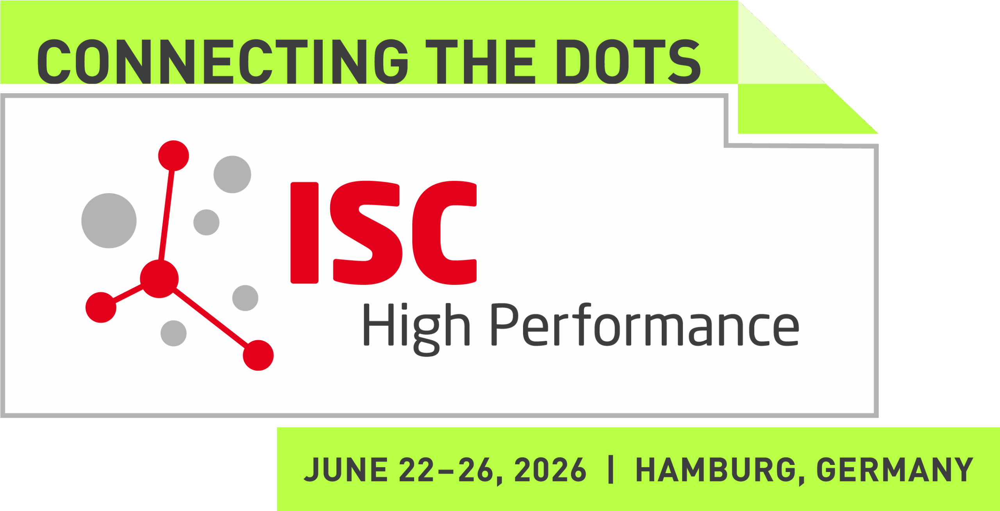

It has long been understood that there is a strong overlap between the fields of HPC and RSE. Although the two are not entirely congruent, the techniques used and the communities are closely interlinked.
To leverage these synergies, the 3rd RSEHPC workshop will be held at ISC 2026.
This iteration of the workshop will focus on discussing and exchanging on the topic of applying AI techniques and tools for research software development in the HPC context.

<!--more-->

- [Motivation](#motivation)
- [Keynote](#keynotes)
- [Timetable](#timetable)
- [Organising committee](#orga)

### Motivation
{: #motivation}

It has long been understood that there is a strong overlap between the fields of HPC and RSE. Although the two are not entirely congruent, the techniques used and the communities are closely interlinked.
To leverage these synergies, the 3rd RSEHPC workshop will be held at ISC 2026.

GenAI tools have shown tremendous opportunities and promising applications for a wide range of fields, including software engineering. While these are commonly not specifically designed for the field of HPC, many approaches are promising to also be leveraged for HPC applications and their development. With the ever-growing complexity and heterogeneity of HPC systems, these approaches can be an invaluable tool for HPC researchers and RSEs to ease adapting code and porting code to different systems. GenAI tools can help design test cases and ease the creation of a CI/CB pipeline for HPC codes. In addition, they can ease the documentation of code and dissemination to the users, for example but not limited to using GenAI based chat-bots as an entry point for the users. However, these approaches do not come without their drawbacks and challenges, which we will also highlight as part of the keynotes.

In this workshop, participants will be able to exchange ideas, approaches, good practices, but also obstacles on the way to an efficient utilization of AI tools for software on HPC systems. Driven by keynote talks, which will set the stage, participants are encouraged to share their own experiences, both from a user’s, developer and operations perspective. To foster this exchange, we foresee the second part of the workshop to provide a stage for participants to showcase their experiences with demos and hands-on examples or contribute their expertise and experience with lightning talks, covering experiences, plans, success stories and scary tales. For these contributions we foresee a light-weight submission including a review by well-known international RSE, AI, and HPC experts. This part will offer a balance between presentations and content by the contributors, and discussion and exchange with the audience. In addition, we foresee a part where open questions to the audience will be posed, helping everyone to add their thoughts to this event.

Topics include, but are not limited to:
- User’s perspective: How do users experience the existing solutions? Is there something missing, from technological solutions to convenience?
- Demos and hands-on examples for using AI techniques in HPC software development
- Success stories and scary tales for AI techniques
- Legal aspects of using AI techniques
- Past, present and future: how are AI tools evolving? What might be (near-term) future opportunities and challenges?

The RSEHPC@ISC26 will be held in-person on 26th June 2026, 2pm-6pm in Hamburg.

### Timetable
{: #timetable}

| Time | Topic | Speaker |
|---|---|---|
| 2:00 pm | Welcome and introductions | René Caspart and Robert Speck |
|---|---|---|
| 2:05 pm | LLMs for HPC coding | Amirreza Rastegari, Microsoft Research | 
|---|---|---|
| 2:25 pm | GenAI for (Research) Software Engineering: Opportunities and Pitfalls | Sunita Chandrasekaran, University of Delaware |
|---|---|---|
| 2:45 pm | Legal aspects of AI in software development | Giuditta Parolini, Museum für Naturkunde – Leibniz Institute for Evolution and Biodiversity Science |
|---|---|---|
| 3:05 pm - 4:00 pm | 5 Lightning Talks | |
|  |  
|---|---|---|
| 4:00 pm |  Coffee Break | |
|---|---|---|
| 4:30 pm - 5:25 pm |  5 Lightning talks | | 
|  | 
|---|---|---|
| 5:25 pm - 6:00 pm | Open Floor and Discussion | |
|---|---|---|

### Keynotes
{: #keynotes}

The three keynotes will set the stage for the workshop, showing was has been achieved so far and how Cx plays a vital role for running, procuring and planning HPC machines.

#### LLMs for HPC coding
Speaker: Amirreza Rastegari, Microsoft Research

Abstract:
tba

#### GenAI for (Research) Software Engineering: Opportunities and Pitfalls

Speaker: [Sunita Chandrasekaran](https://www.cis.udel.edu/people/faculty/sunita-chandrasekaran/), University of Delaware

Abstract: 
tba

#### Legal aspects of AI in software development

Speaker: [Giuditta Parolini](https://www.museumfuernaturkunde.berlin/de/museum/heute/team/giuditta.parolini), Museum für Naturkunde – Leibniz Institute for Evolution and Biodiversity Science

Abstract:
tba

### Organising committee:
{: #orga}

- René Caspart (Karlsruhe Institute of Technology)
- Robert Speck (Forschungszentrum Juelich)
- Claire Wyatt (Forschungszentrum Juelich)
- Stefanie Reuter (ECMWF)
- Matthew Archer (University of Cambridge)
- Andy Turner (EPCC)
- Daniel S. Katz (National Center for Supercomputing Applications, University of Illinois Urbana-Champaign)
- Guido Juckeland (Helmholtz-Zentrum Dresden-Rossendorf)
- Alfio Lazzaro (Hewlett Packard Enterprise)

### Code of conduct:
As an ISC co-located workshop we follow ISC’s code of conduct, which can be found  [here](https://isc-hpc.com/contact-code-of-conduct/)

