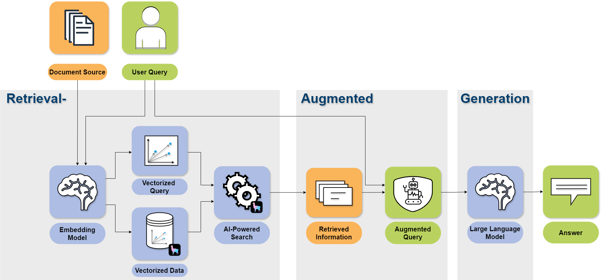

On April 2nd, 2025, 2pm CEST, **Mascha Schmidt, Victor Haguet and Fritz Niesel** from the [Applied Machine Learning Group](https://www.fz-juelich.de/en/ias/jsc/about-us/structure/simulation-and-data-labs/sdl-applied-machine-learning) based at the Jülich Supercomputing Centre will join us at the HiRSE Seminar Series with their talk about **Bridging the Gap Between Private Data and AI: A Beginner’s Guide to Retrieval Augmented Generation (RAG)**.
<!--more-->

**Abstract**:

AI is transforming administrative and scientific workflows by automating tedious cognitive tasks. However, one of our most valuable resources - private and sensitive documents - often remains inaccessible to AI solutions.
Retrieval Augmented Generation (RAG) offers a way to bridge this gap. It enables AI models to efficiently process and search large private data sources while maintaining control over data access and security.

In this talk, we’ll guide you through the process of building a RAG system, from understanding its core components to integrating it into real-world applications. We’ll begin by introducing RAG and demonstrating how it enhances knowledge retrieval where standard LLMs fall short.
Then, we’ll break down key concepts such as chunking, embedding, vector storage and retrieval. Finally, we’ll explore how to tailor RAG for advanced use cases and integrate it into data-driven applications.

Whether you're a developer, researcher, or AI enthusiast, this session will provide a clear roadmap for using RAG effectively. Join us to learn when to use RAG, what to expect, and how to take your LLM applications to the next level.

***
A **recording** of this seminar can be found on the [HiRSE YouTube Channel](https://www.youtube.com/watch?v=L-3ypGheljs)

**Slides** from this presentation can be found in the [HiRSE Zenodo Community](https://zenodo.org/records/15130532)

