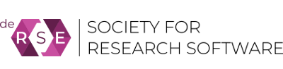
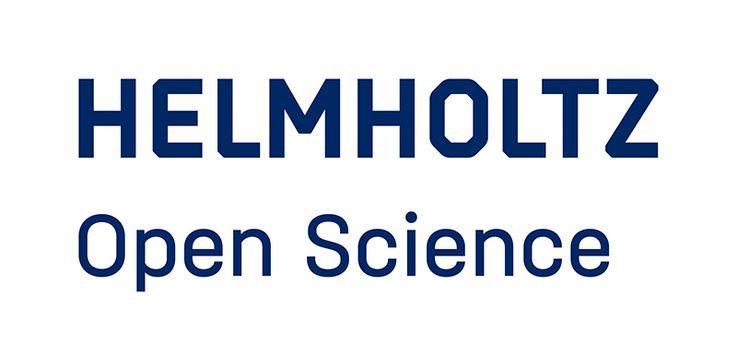
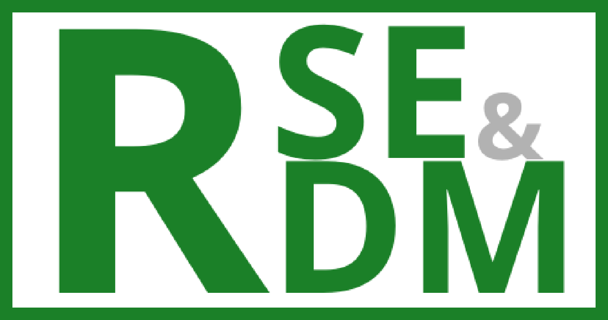

# HiRSE Allies

  

 

The top position of Helmholtz research is increasingly based on cross-centre and international cooperation and common access to data treasure and -services. At the same time, the significance of a sustainable software development for the research process is recognised.

**HIFIS builds and sustains an excellent IT infrastructure connecting all Helmholtz research fields and centres.**

This includes the Helmholtz Cloud, where members of the Helmholtz Association of German Research Centres provide selected IT-Services for joint use. HIFIS further supports Research Software Engineering (RSE) with a high level of quality, visibility and sustainability.

The HIFIS clusters develop technologies, processes and policy frameworks for harmonized access to fundamental backbone services, such as Helmholtz AAI, and Helmholtz Cloud services. HIFIS Software also provides education, technology, consulting and community services.

**Helmholtz Digital Services for Science — Collaboration made easy.**

---

  

Software development is an essential, integral part of research activity. Research software increasingly supports the acquisition, processing and analysis of empirical data, but also the modeling and the simulation of complex processes. Thus, software has a significant influence on the quality of research results. The British Software Sustainability Institute (SSI) has coined the slogan “Better Software - Better Research”.

However, the current approaches to research software as well as the recognition of research software engineering do not adequately reflect the importance of this work in and for the research process. Researchers, scientists and others developing software in and for research within the German scientific landscape have come together in the de-RSE community in order to considerably boost the visibility of these issues, and to decisively improve the current situation. de-RSE aims at constituting a wider initiative for acting jointly on shared objectives, and being the collective spokesperson for RSEs within the German scientific landscape.

---

  

Guided by the motto "Enabling open science practices in Helmholtz!" the Helmholtz Open Science Office works within the Association and promotes the visibility of Helmholtz on a national as well as international level within the context of Open Science in the spirit of the Helmholtz mission.

The mission of the Helmholtz Open Science Office is to promote the cultural change towards open science. The office, established by the Helmholtz Association in 2005, sees itself as a service provider that supports the community in shaping the cultural change towards open science. The Helmholtz Open Science Office is a partner of all stakeholders involved in this process within Helmholtz.

---

  

 

The development of research software and the handling of research data has been essential for many areas within the fields of the [GAMM](https://www.gamm.org/en/) for decades and ranges from simulation scripts and data to accompany publications to extensive software libraries and petabytes of data for specific application areas.

The GAMM Activity Group on Research Software Engineering and Research Data Management in Mathematics & Mechanics (GAMM FA RSE&RDM) aims at making a contribution here by providing impetus from the perspective of computer-driven sciences. They want to give the GAMM activities in the areas of research data and research software a visible home and promote synergies in the scientific exchange between the activities groups and identify GAMM-specific infrastructure requirements and fields of action.
