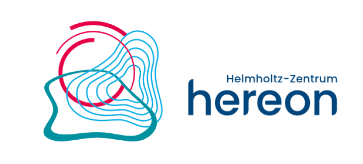
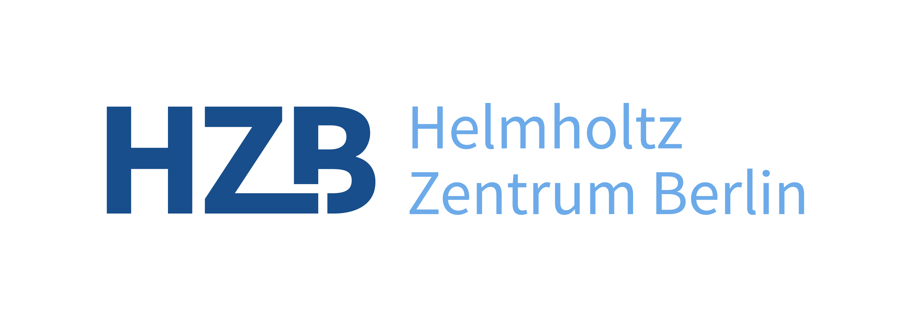

# HiRSE_PS Partners

  

Forschungszentrum Jülich (FZJ) pursues cutting-edge interdisciplinary research on pressing issues facing society today. With its competence in materials science and simulation, and its expertise in physics, nanotechnology, and information technology, as well as in the biosciences and brain research, Jülich is developing the basis for the key technologies of tomorrow. In this way, Forschungszentrum Jülich helps to solve the grand challenges facing society in the fields of energy and the environment as well as information and the brain. 

Forschungszentrum Jülich is also breaking new ground in the form of strategic partnerships with universities, research institutions, and industry in Germany and abroad. With more than 5,500 employees, Jülich – a member of the Helmholtz Association – is one of the large interdisciplinary research centres in Europe.

 

---

  

The Karlsruhe Institute of Technology (KIT) is “The Research University in the Helmholtz Association.” As the only German university of excellence with a national large-scale research sector, we offer our students, researchers, and employees unique learning, teaching, and working conditions. The roots of the academic education institution extend all the way back to 1825. Today’s structure of KIT is the result of the merger of the Technical University of Karlsruhe and Karlsruhe Research Center in 2009.

Presently, more than 9000 people are working at KIT, of which more than half are conducting research in a broad range of disciplines from natural sciences to engineering, to economics, to the humanities and social sciences. This makes KIT one of the largest science institutions in Europe. Apart from excellent academic education and cutting-edge research, innovation is our central task. We do not only create and impart knowledge for the society and the environment, we also use this knowledge to develop applications for industry. It is our goal to help manage global challenges facing humankind by pioneer research contributions in the areas of energy, mobility, and information. Doing this, we attach high importance to permanent contact and exchange with society. 

 

---

  

Helmholtz-Zentrum Hereon conducts international cutting-edge research for a changing world: approximately 1,100 employees generate knowledge and innovation to facilitate more resilience and sustainability. Hereon’s scientific spectrum encompasses high-performance materials, processes and environmentally friendly technologies for mobility and new energy systems. Furthermore, research is conducted on biomaterials for medicine and for increasing the quality of life. Through research and consulting, Hereon addresses the challenges of climate change in a solution-oriented manner and facilitates sustainable management as well as the protection of the coasts and marine environment through comprehensive scientific understanding. From basic understanding to practical applications – the interdisciplinary research center covers a unique spectrum.

As part of an international network and as a member of the Helmholtz Association, Hereon supports political, economic and societal institutions in shaping the future through the transfer of its expertise. Founded in 1956, the center is the largest non-university research institution in Schleswig-Holstein. In addition to its main location in Geesthacht and its site in Teltow near Berlin, Hereon has branches in Hamburg, Kiel, Berlin and Garching bei München. The research center has an annual budget of approximately 130 million Euros.

 

---

  

Materials for a sustainable energy supply and operation of the electron storage ring BESSY II – those are the cornerstones of Helmholtz-Zentrum Berlin and its research. Both of these fields complement each other, since questions arising from research continually drive the advancement of the experimental environment at BESSY II and vice versa; the possibilities that BESSY II offers accelerate energy research enormously.

HZB has existed since 2009. Its roots go much further into the past, given that HZB arose from the fusion of two older research institutions, the former Hahn-Meitner-Institut (est. 1959) and BESSY GmbH (est. 1979). With approximately 1,100 employees, HZB is now one of the largest non-university research centres in Berlin, and a member of the Helmholtz Association. HZB conducts research at two locations, in Wannsee and Adlershof.
 

---
# HiRSE_PS Ally

  

 

The top position of Helmholtz research is increasingly based on cross-centre and international cooperation and common access to data treasure and -services. At the same time, the significance of a sustainable software development for the research process is recognised.

**HIFIS builds and sustains an excellent IT infrastructure connecting all Helmholtz research fields and centres.**

This includes the Helmholtz Cloud, where members of the Helmholtz Association of German Research Centres provide selected IT-Services for joint use. HIFIS further supports Research Software Engineering (RSE) with a high level of quality, visibility and sustainability.

The HIFIS clusters develop technologies, processes and policy frameworks for harmonized access to fundamental backbone services, such as Helmholtz AAI, and Helmholtz Cloud services. HIFIS Software also provides education, technology, consulting and community services.

**Helmholtz Digital Services for Science — Collaboration made easy.**

