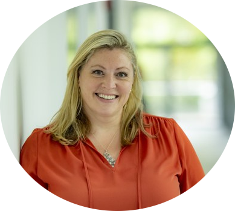

# The HiRSE Seminar Series

The HiRSE Seminar Series is a series of talks revolving around topics relevant for and to Research Software Engineering.
The seminars cover a broad range of topics from political to technical ones, take place every 2 to 4 weeks.
The events are open to everyone interested and held online.

You can use our [feedback form](https://forms.gle/XH2fMa3MEikjB9pt5) to tell us what you think about the seminar series and what other topics we should cover.

The announcement and connection details are posted here:

- HiRSE_PS-internal HiRSE Mattermost channel,
- HIFIS Mattermost channel,
- Helmholtz Open Science Mattermost Channel
- FZJ-internal #rse Rocket.Chat channel,
- de-RSE mailing list and de-RSE Mattermost channel,
- Helmholtz Open Science Pro Mailinglist
- RSE mailing lists of the HiRSE partners (if any).

# Your host

The HiRSE Seminar Series is hosted by [Claire Wyatt](https://www.fz-juelich.de/profile/wyatt_cl), Community Manager for Research Software Engineering at Forschungszentrum Jülich. 

# Events
